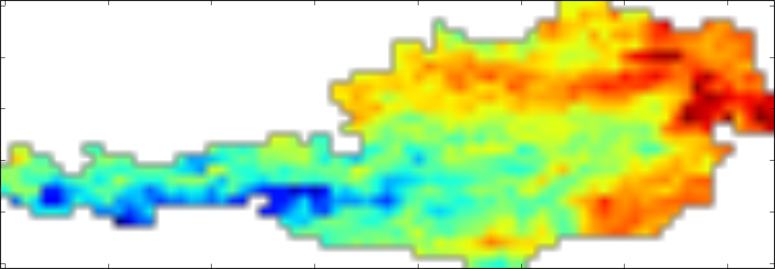

Reading and plotting images
===========================

This example shows how to read and plot images from the resampled NetCDF file.
It presumes that we already set up a Poet class and added the source `MODIS_LST` as 
given in `Setting up a Poet base class`_. For plotting, we will use `Matplotlib <http://matplotlib.org>`_.

Reading the image can be done with the :class:`poets.io.source_base.BasicSource.read_img` method.
Please note that this method returns the image as numpy array and additionally the longitudes and latitudes of the image.

In[9]::

   import matplotlib.pyplot as plt
   
   image, lon, lat = p.sources['MODIS_LST'].read_img(datetime(2000, 5, 31))
   
   plt.figure()
   plt.imshow(image)
   plt.show()

In this example we plot the image for the last dekad in May 2000.

