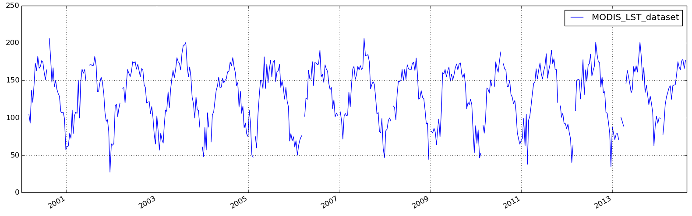

Reading and plotting time series
================================

This example shows how to read and plot time series data from the resampled NetCDF file.
It presumes that we already set up a Poet class and added the source `MODIS_LST` as 
given in `Setting up a Poet base class`_. For plotting, we will use `Matplotlib <http://matplotlib.org>`_.

Reading the image can be done with the :class:`poets.poet.Poet.read_timeseries` method.
You can read time series only for gridpoints given in the defined region(s). To get a list of available
gridpoints, you can call :class:`poets.poet.Poet.get_gridpoints`. It is also possible to call the read_timeseries function with longitude/latitude values. In this case the location parameter must be given as tuple

In[11]::

   import matplotlib.pyplot as plt
   
   # Get a list of valid gridpoints
   gridpoints = p.get_gridpoints()
   
   # Reading the time series for point 1632
   ts = p.read_timeseries('MODIS_LST', 1632)
   
   # Reading the time series with given lon/lat values:
   ts = p.read_timeseries('MODIS_LST', (15.391416550, 48.497042624))
   
   # Plot time series
   ts.plot()
   plt.show()

And this is how the result will look like:

If poets is set up for multiple regions and/or the defined source has multiple variables, the parameters `region` and `variable` must be set. See :class:`poets.poet.Poet.read_timeseries` for more information.